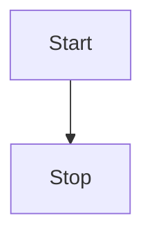

# Hướng dẫn dành cho Tác giả: Soạn thảo bài viết trên Cuccung SEO

Chào mừng bạn đến với hệ thống CMS của Cuccung! Để bài viết của bạn đạt hiệu quả SEO tốt nhất và có trình bày chuyên nghiệp, hãy tham khảo các hướng dẫn sau.

---

## 1. Cấu trúc bài viết (SEO)

- **Tiêu đề Chính:** HĐ (H1) - Chỉ sử dụng 1 lần duy nhất (Hệ thống tự động dùng tiêu đề bài viết làm H1).
- **Các mục lớn:** Sử dụng thẻ `##` (H2). Bài viết cần tối thiểu **3 thẻ H2** để Google đánh giá cao cấu trúc.
- **Các mục con:** Sử dụng thẻ `###` (H3) hoặc `####` (H4).

---

## 2. Định dạng văn bản cơ bản (Markdown Base)

- **Chữ đậm:** `**nội dung**` -> **nội dung**
- **Gạch chân:** `<u>nội dung</u>` -> <u>nội dung</u>
- **Chữ nghiêng:** `*nội dung*` -> *nội dung*
- **Gạch ngang:** `~~nội dung~~` -> ~~nội dung~~
- **Số mũ:** `x^26^` -> x^26^
- **Chỉ số dưới:** `H~2~O` -> H~2~O
- **Code dòng:** \`nội dung\` -> `nội dung`
- **Liên kết:** `[Tên](url)` -> [Link](https://github.com/imzbf)

---

## 3. Chèn Hình ảnh (Quan trọng)

Để chèn ảnh, bạn hãy thực hiện theo quy trình sau:
1. Tải ảnh lên tại phần **Media Assets** bên dưới trình soạn thảo.
2. Nhập **Alt Text** (Mô tả ảnh) - Đây là yêu cầu bắt buộc để SEO hình ảnh.
3. Nhấn vào biểu tượng **Markdown** (Copy) để lấy mã code.
4. Dán mã code vào vị trí bạn muốn trong bài viết.

**Mã code mẫu:** ``

---

## 4. Danh sách & Trích dẫn

- **Trích dẫn:** 
  ```markdown
  > quote: I Have a Dream
  ```
- **Danh sách có thứ tự:** `1.`, `2.`, `3.`
- **Danh sách không thứ tự:** `-` hoặc `*`
- **Danh sách công việc (Task list):**
  - [ ] Chưa làm
  - [x] Đã xong

---

## 5. Bảng & Công thức Toán học

### Bảng (Table)
| Đặc điểm | Sản phẩm A | Sản phẩm B |
| :--- | :---: | ---: |
| Trái | Giữa | Phải |

### Công thức (Formula)
- Nội dòng: `$x+y^{2x}$`
- Khối công thức:
  ```markdown
  $$
  \sqrt[3]{x}
  $$
  ```

---

## 6. Sơ đồ (Diagram) & Biểu đồ

### Mermaid (Sơ đồ luồng)


### Echarts (Biểu đồ số liệu)
```echarts
{
  xAxis: { type: 'category', data: ['Mon', 'Tue', 'Wed'] },
  yAxis: { type: 'value' },
  series: [{ data: [150, 230, 224], type: 'line' }]
}
```

---

## 7. Thông báo nổi bật (Alerts / Admonitions)

Sử dụng cú pháp `!!!` để tạo các khối thông báo đẹp mắt:

```markdown
!!! tip Mẹo nhỏ
Đây là nội dung thông báo Tip.
!!!

!!! warning Cảnh báo
Nội dung cảnh báo quan trọng.
!!!
```
*Các loại hỗ trợ:* `note`, `abstract`, `info`, `tip`, `success`, `question`, `warning`, `failure`, `danger`, `bug`, `example`, `quote`, `hint`, `caution`, `error`, `attention`.

---

*Chúc bạn có những bài viết chất lượng trên Cuccung!*
